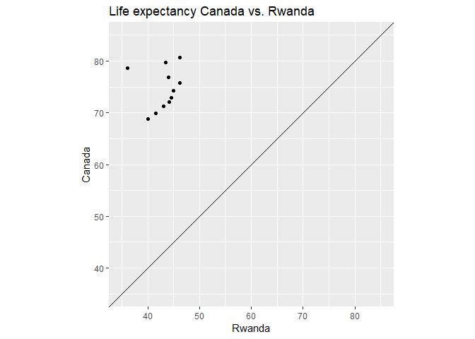

hw04-gapminder
================
@RetoSterchi
September 30, 2018

Homework 04: Tidy data and joins
================================

First step: Load packages
-------------------------

``` r
require(gapminder)
require(ggplot2)
require(dplyr)
require(tidyr)
```

Data Reshaping Activity \#2
---------------------------

### Task description

Make a tibble with one row per year and columns for life expectancy for two or more countries.

-   Use `knitr::kable()` to make this table look pretty in your rendered homework.
-   Take advantage of this new data shape to scatterplot life expectancy for one country against that of another.

Let's use the *spread* function to re-arrange our data into a wide format. (<https://tidyr.tidyverse.org/reference/spread.html>)

``` r
knitr::kable(
  
  gapminder %>%
  filter(country %in% c("Canada", "Japan", "Rwanda")) %>% 
  select(year, country, lifeExp) %>% ## select columns 
  spread(country, lifeExp) %>% ## reshape to wide
  rename(Year = year) ## rename column for table

)
```

|  Year|  Canada|   Japan|  Rwanda|
|-----:|-------:|-------:|-------:|
|  1952|  68.750|  63.030|  40.000|
|  1957|  69.960|  65.500|  41.500|
|  1962|  71.300|  68.730|  43.000|
|  1967|  72.130|  71.430|  44.100|
|  1972|  72.880|  73.420|  44.600|
|  1977|  74.210|  75.380|  45.000|
|  1982|  75.760|  77.110|  46.218|
|  1987|  76.860|  78.670|  44.020|
|  1992|  77.950|  79.360|  23.599|
|  1997|  78.610|  80.690|  36.087|
|  2002|  79.770|  82.000|  43.413|
|  2007|  80.653|  82.603|  46.242|

Now let's take this re-shaped data and make a scatterplot that shows life expectancy for one country against that of another.

``` r
gapminder %>%
  
  ## Reshape data (same as above)
  filter(country %in% c("Canada", "Japan", "Rwanda")) %>% 
  select(year, country, lifeExp) %>% ## select columns 
  spread(country, lifeExp) %>% ## reshape to wide
  rename(Year = year) %>% ## rename column for table
  
  ## plot the data
  ggplot(aes(x = Rwanda, y = Canada)) + ## set up plot
  geom_point() + ## ad points
  xlim(35,85) + ## use custom x scale
  ylim(35,85) + ## use custom y scale
  coord_fixed() + ## makes x/y axes equal scaled, squared
  geom_abline(intercept = 0, slope = 1) + ## add diagonal line for reference
  ggtitle("Life expectancy Canada vs. Rwanda") ## add title
```

    ## Warning: Removed 1 rows containing missing values (geom_point).



Looks like the life expectancy in Canada is almsost twice as high as the one from Rwanda.

Data Join Activity \#1
----------------------

### Task description

Create a second data frame, complementary to Gapminder. Join this with (part of) Gapminder using a `dplyr` join function and make some observations about the process and result. Explore the different types of joins. Examples of a second data frame you could build:

-   One row per country, a country variable and one or more variables with extra info, such as language spoken, NATO membership, national animal, or capitol city.
-   One row per continent, a continent variable and one or more variables with extra info, such as northern versus southern hemisphere.

Let's create that supplementray data.frame first with some information in it.

``` r
df <- data.frame("country" = c("Canada", "Japan", "Sweden", "Mexico", "Russia", "France"),
                 "language" = c("English", "Japanese", "Swedish", "Spanish", "Russian", "French"),
                 "hemisphere" = c("N", "N", "N", "N", "N", "N"),
                 "capitalcity" = c("Ottawa", "Tokyo", "Stockholm", "Mexico City", "Moscow", "Paris"))

## when joining the dataframe later on with gapminder we received the following warning message:
## ...
## Joining, by = "country"
## Column `country` joining factors with different levels, coercing to character vector
## ...

## Although it seems to work, let's make sure that we have the data already in the correct format and 
## let's assign the proper factor levels to our data.frame

df$country <- factor(df$country, levels = levels(gapminder$country))
```

There are different types of joins (<https://dplyr.tidyverse.org/reference/join.html>) Mutating joins combine variables from the two data.frames:

-   `inner_join()` return all rows from x where there are matching values in y, and all columns from x and y. If there are multiple matches between x and y, all combination of the matches are returned.
-   `left_join()` return all rows from x, and all columns from x and y. Rows in x with no match in y will have NA values in the new columns. If there are multiple matches between x and y, all combinations of the matches are returned.
-   `right_join()` return all rows from y, and all columns from x and y. Rows in y with no match in x will have NA values in the new columns. If there are multiple matches between x and y, all combinations of the matches are returned.
-   `full_join()` return all rows and all columns from both x and y. Where there are not matching values, returns NA for the one missing.

``` r
gapminder %>% inner_join(df, by = "country")
```

    ## # A tibble: 60 x 9
    ##    country continent  year lifeExp      pop gdpPercap language hemisphere
    ##    <fct>   <fct>     <int>   <dbl>    <int>     <dbl> <fct>    <fct>     
    ##  1 Canada  Americas   1952    68.8 14785584    11367. English  N         
    ##  2 Canada  Americas   1957    70.0 17010154    12490. English  N         
    ##  3 Canada  Americas   1962    71.3 18985849    13462. English  N         
    ##  4 Canada  Americas   1967    72.1 20819767    16077. English  N         
    ##  5 Canada  Americas   1972    72.9 22284500    18971. English  N         
    ##  6 Canada  Americas   1977    74.2 23796400    22091. English  N         
    ##  7 Canada  Americas   1982    75.8 25201900    22899. English  N         
    ##  8 Canada  Americas   1987    76.9 26549700    26627. English  N         
    ##  9 Canada  Americas   1992    78.0 28523502    26343. English  N         
    ## 10 Canada  Americas   1997    78.6 30305843    28955. English  N         
    ## # ... with 50 more rows, and 1 more variable: capitalcity <fct>

``` r
gapminder %>% left_join(df, by = "country")
```

    ## # A tibble: 1,704 x 9
    ##    country   continent  year lifeExp     pop gdpPercap language hemisphere
    ##    <fct>     <fct>     <int>   <dbl>   <int>     <dbl> <fct>    <fct>     
    ##  1 Afghanis~ Asia       1952    28.8  8.43e6      779. <NA>     <NA>      
    ##  2 Afghanis~ Asia       1957    30.3  9.24e6      821. <NA>     <NA>      
    ##  3 Afghanis~ Asia       1962    32.0  1.03e7      853. <NA>     <NA>      
    ##  4 Afghanis~ Asia       1967    34.0  1.15e7      836. <NA>     <NA>      
    ##  5 Afghanis~ Asia       1972    36.1  1.31e7      740. <NA>     <NA>      
    ##  6 Afghanis~ Asia       1977    38.4  1.49e7      786. <NA>     <NA>      
    ##  7 Afghanis~ Asia       1982    39.9  1.29e7      978. <NA>     <NA>      
    ##  8 Afghanis~ Asia       1987    40.8  1.39e7      852. <NA>     <NA>      
    ##  9 Afghanis~ Asia       1992    41.7  1.63e7      649. <NA>     <NA>      
    ## 10 Afghanis~ Asia       1997    41.8  2.22e7      635. <NA>     <NA>      
    ## # ... with 1,694 more rows, and 1 more variable: capitalcity <fct>

``` r
gapminder %>% right_join(df, by = "country")
```

    ## # A tibble: 61 x 9
    ##    country continent  year lifeExp      pop gdpPercap language hemisphere
    ##    <fct>   <fct>     <int>   <dbl>    <int>     <dbl> <fct>    <fct>     
    ##  1 Canada  Americas   1952    68.8 14785584    11367. English  N         
    ##  2 Canada  Americas   1957    70.0 17010154    12490. English  N         
    ##  3 Canada  Americas   1962    71.3 18985849    13462. English  N         
    ##  4 Canada  Americas   1967    72.1 20819767    16077. English  N         
    ##  5 Canada  Americas   1972    72.9 22284500    18971. English  N         
    ##  6 Canada  Americas   1977    74.2 23796400    22091. English  N         
    ##  7 Canada  Americas   1982    75.8 25201900    22899. English  N         
    ##  8 Canada  Americas   1987    76.9 26549700    26627. English  N         
    ##  9 Canada  Americas   1992    78.0 28523502    26343. English  N         
    ## 10 Canada  Americas   1997    78.6 30305843    28955. English  N         
    ## # ... with 51 more rows, and 1 more variable: capitalcity <fct>

``` r
gapminder %>% full_join(df, by = "country")
```

    ## # A tibble: 1,705 x 9
    ##    country   continent  year lifeExp     pop gdpPercap language hemisphere
    ##    <fct>     <fct>     <int>   <dbl>   <int>     <dbl> <fct>    <fct>     
    ##  1 Afghanis~ Asia       1952    28.8  8.43e6      779. <NA>     <NA>      
    ##  2 Afghanis~ Asia       1957    30.3  9.24e6      821. <NA>     <NA>      
    ##  3 Afghanis~ Asia       1962    32.0  1.03e7      853. <NA>     <NA>      
    ##  4 Afghanis~ Asia       1967    34.0  1.15e7      836. <NA>     <NA>      
    ##  5 Afghanis~ Asia       1972    36.1  1.31e7      740. <NA>     <NA>      
    ##  6 Afghanis~ Asia       1977    38.4  1.49e7      786. <NA>     <NA>      
    ##  7 Afghanis~ Asia       1982    39.9  1.29e7      978. <NA>     <NA>      
    ##  8 Afghanis~ Asia       1987    40.8  1.39e7      852. <NA>     <NA>      
    ##  9 Afghanis~ Asia       1992    41.7  1.63e7      649. <NA>     <NA>      
    ## 10 Afghanis~ Asia       1997    41.8  2.22e7      635. <NA>     <NA>      
    ## # ... with 1,695 more rows, and 1 more variable: capitalcity <fct>

This corresponds to the following merges in base R:

``` r
merge(gapminder, df, by = "country") ## merge to matches in both sides
merge(gapminder, df, by = "country", all.x = TRUE) ## merge to matches on the left
merge(gapminder, df, by = "country", all.y = TRUE) ## merge to matches on the right
merge(gapminder, df, by = "country", all = TRUE) ## merge both sides, fill NA's if no matches
```
